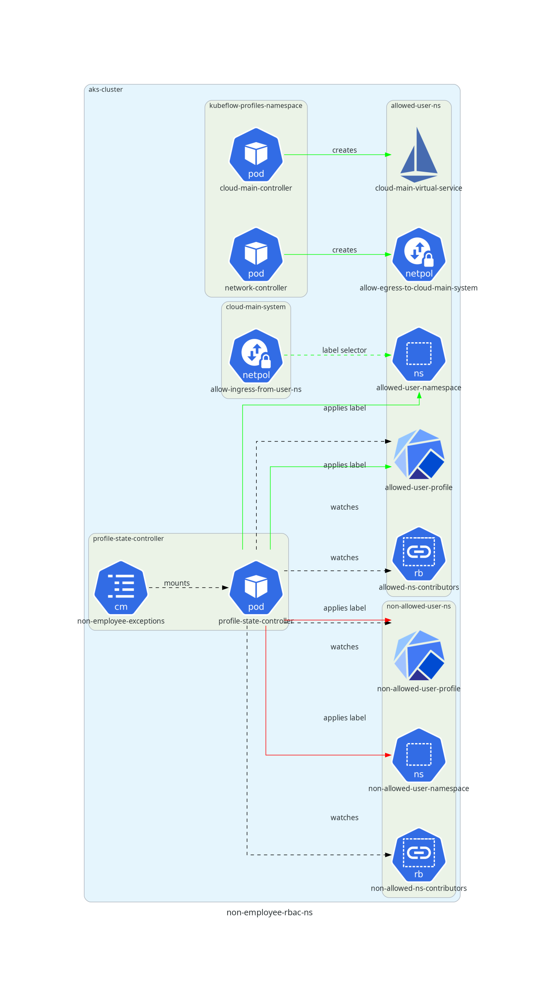

# Overview

Some non-employee users of the AAW platform are authorized to perform some (but not all) of the capabilities that Statcan employees can perform. The platform components detailed on this page allow administrators to extend certain capabilities to certain non-employee users who are authorized to perform those capabilities.

The two main capabilities that are relevant are (1) the ability to create pods with certain base images (e.g. SAS), or (2) the ability to access certain cloud main resources (e.g. gitlab.k8s). The documentation below focuses on these two types of capabilities; additional controls may be required for capabilities that don't fall under the abovementioned types.

## Relevant Repositories

- [aaw-profile-state-controller](https://github.com/StatCan/aaw-profile-state-controller)
- [aaw-kubeflow-profiles-controller](https://github.com/StatCan/aaw-kubeflow-profiles-controller)
- [gatekeeper-policies](https://github.com/StatCan/gatekeeper-policies)
- [aaw-gatekeeper-constraints](https://github.com/StatCan/aaw-gatekeeper-constraints)
- [jupyter-apis](https://github.com/StatCan/jupyter-apis)
- [aaw-kubeflow-profiles](https://github.com/StatCan/aaw-kubeflow-profiles)
- [aaw-network-policies](https://github.com/StatCan/aaw-network-policies)

## How to Add/Remove Users from Capabilities

> TODO

## How to Add a New Capability

> TODO

# Feature Deployment

> TODO

# Feature Implementation

> TODO

## Pod/Notebook Capabilities

> TODO

## Namespace Capabilities

> TODO

